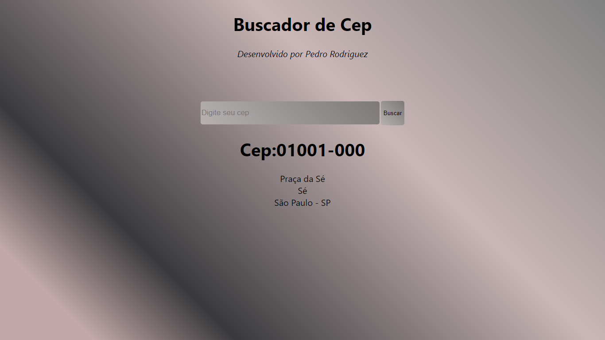

Application made with react.js using the ViaCep api, a simple CEP search engine, is part of my React-Apps portfolio, I was unable to deploy it on the github pages for some reason but the codes are available here and I accept comments.

